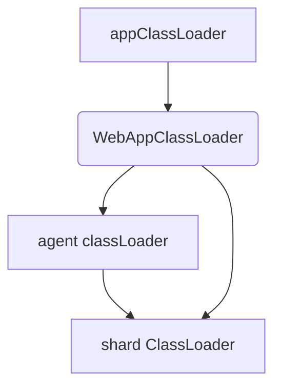

classLoader

   对于agent，他的平级目录class文件是被appClassLoader引用，promagent-agent下面的四个class，可被全局的class所访问；

ClassLoaderCache作为单例，不同的classLoader，例如webappClassLoader回调的时候，ClassLoaderCache会将共享的jar分享出去，

因为ClassLoaderCache先查询 sharedClassLoader，ClassLoaderCache单例，所以sharedClassLoader对象唯一，所以全局会共享一个Delegator【Delegator用于精确匹配回调方法】

